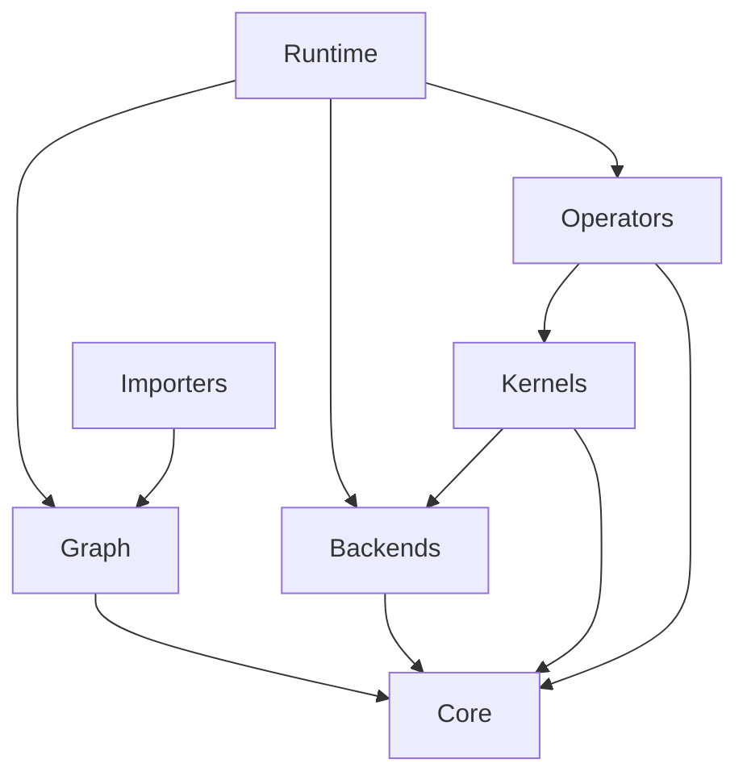

# Mini-Infer 项目结构说明

本文档详细说明了 Mini-Infer 项目的目录结构和文件组织。

## 顶层目录结构

```
Mini-Infer/
├── CMakeLists.txt          # 顶层 CMake 配置文件
├── CMakeUserPresets.json   # 用户自定义 CMake 预设（可选）
├── conanfile.py            # Conan 包配置文件
├── README.md               # 项目说明文档
├── QUICK_START.md          # 快速开始指南
├── LICENSE                 # MIT 许可证
├── PROJECT_STRUCTURE.md    # 本文件
├── include/                # 公共头文件目录
├── src/                    # 源代码实现目录
├── tests/                  # 测试代码目录
├── examples/               # 示例代码目录
├── docs/                   # 文档目录
├── models/                 # 模型文件和训练脚本
└── build/                  # 构建目录（由 Conan 生成）
    ├── Debug/              # Debug 构建
    ├── Release/            # Release 构建
    └── generators/         # Conan 生成的文件
        ├── CMakePresets.json      # 自动生成的 CMake 预设
        ├── conan_toolchain.cmake  # Conan 工具链
        └── CMakeDeps.cmake        # 依赖配置
```

## include/ - 头文件目录

公共 API 头文件，按模块组织：

```
include/mini_infer/
├── mini_infer.h           # 主头文件
├── core/                  # Core 模块 (数据结构)
│   ├── tensor.h           # Tensor, Storage 类
│   ├── allocator.h        # Aligned Allocator
│   └── types.h            # 基础类型 (DataType, DeviceType)
├── runtime/               # Runtime 模块 (推理引擎)
│   ├── engine.h           # Engine 门面
│   ├── inference_plan.h   # 推理计划 (Static)
│   ├── execution_context.h # 执行上下文 (Dynamic)
│   └── memory_planner.h   # 静态内存规划器
├── graph/                 # Graph 模块 (拓扑)
│   ├── node.h             # Node (包含 Port 定义)
│   └── graph.h            # Graph 容器
├── backends/              # Backends 模块 (执行环境)
│   └── device_context.h   # 设备上下文基类
├── operators/             # Operators 模块 (插件化算子系统)
│   ├── operator.h         # Operator 基类 (元数据容器)
│   ├── plugin_base.h      # IPlugin 接口定义
│   ├── plugin_registry.h  # PluginRegistry 单例注册表
│   ├── cpu_plugin.h       # CPUPlugin CRTP 基类
│   ├── cuda_plugin.h      # CUDAPlugin CRTP 基类
│   ├── generic_operator.h # 通用算子容器
│   └── plugin_operator_adapter.h  # Plugin-Operator 适配器
├── kernels/               # Kernels 模块 (底层计算原语)
│   └── kernel_base.h      # Kernel 基础接口
└── importers/             # Importers 模块 (前端)
    └── onnx_parser.h      # ONNX 解析器
```

## src/ - 源代码目录

实现文件，与头文件结构对应：

```
src/
├── core/                  # Core 实现
├── runtime/               # Runtime 实现
│   ├── engine.cpp
│   ├── inference_plan.cpp
│   ├── execution_context.cpp
│   └── memory_planner.cpp
├── graph/                 # Graph 实现
├── backends/              # Backends 实现
│   ├── cpu/               # CPU DeviceContext 实现
│   └── cuda/              # CUDA DeviceContext 实现
├── kernels/               # Kernels 实现 (底层计算原语)
│   ├── cpu/               # CPU Kernel 实现
│   │   ├── gemm_cpu.cpp   # GEMM 矩阵乘法
│   │   ├── im2col_cpu.cpp # Im2Col 变换
│   │   └── ...
│   └── cuda/              # CUDA Kernel 实现
│       ├── gemm_cuda.cu
│       ├── im2col_cuda.cu
│       └── ...
├── operators/             # Operators 实现 (插件化算子)
│   ├── plugin_registry.cpp  # 插件注册表实现
│   ├── cpu/               # CPU 插件实现
│   │   ├── conv2d_cpu.cpp
│   │   ├── linear_cpu.cpp
│   │   ├── relu_cpu.cpp
│   │   ├── pooling_cpu.cpp
│   │   ├── flatten_cpu.cpp
│   │   ├── reshape_cpu.cpp
│   │   └── softmax_cpu.cpp
│   └── cuda/              # CUDA 插件实现
│       ├── conv2d_cuda.cu
│       ├── linear_cuda.cu
│       ├── relu_cuda.cu
│       ├── pooling_cuda.cu
│       ├── flatten_cuda.cu
│       ├── reshape_cuda.cu
│       └── softmax_cuda.cu
├── importers/             # Importers 实现
    └── internal/          # 内部实现 (Pimpl)
        └── onnx_graph_builder.cpp
```

## 关键模块职责

### 1. Runtime
运行时的大脑。
- **Engine**: 用户接口。
- **InferencePlan**: 编译期产物，包含优化后的图和内存偏移量表。
- **ExecutionContext**: 运行期产物，持有实际的内存池和 Tensor 实例。

### 2. Operators (插件化算子系统)
采用 **TensorRT-style Plugin 架构**，实现算子与计算的解耦。

- **IPlugin 接口**: 定义算子的标准接口（形状推导、执行、工作空间等）。
- **PluginRegistry**: 全局单例注册表，按 `{OpType, DeviceType}` 查找插件。
- **CPUPlugin / CUDAPlugin**: CRTP 基类，提供设备特定的默认实现。
- **Plugin 实现**: 每个算子在每个设备上有独立的插件实现（如 `Conv2DCPUPlugin`, `ReLUCUDAPlugin`）。

### 3. Kernels
底层计算原语，被 Plugin 调用。
- **GEMM**: 通用矩阵乘法。
- **Im2Col**: 卷积的图像到列变换。
- **Bias**: 偏置加法。
- **Transpose**: 矩阵转置。

### 4. Core
基础数据结构。
- **Tensor**: 实现了 View 机制，Metadata 与 Data 分离。
- **Storage**: 管理原始内存块，支持引用计数。

## 依赖关系



## 构建产物

*   `mini_infer_core`: 基础库
*   `mini_infer_runtime`: 引擎库（包含 Graph, Backends 等）
*   `mini_infer_kernels`: 算子库
*   `mini_infer_importers`: ONNX 解析库

通常用户只需链接 `mini_infer_runtime` 和 `mini_infer_importers` 即可。
