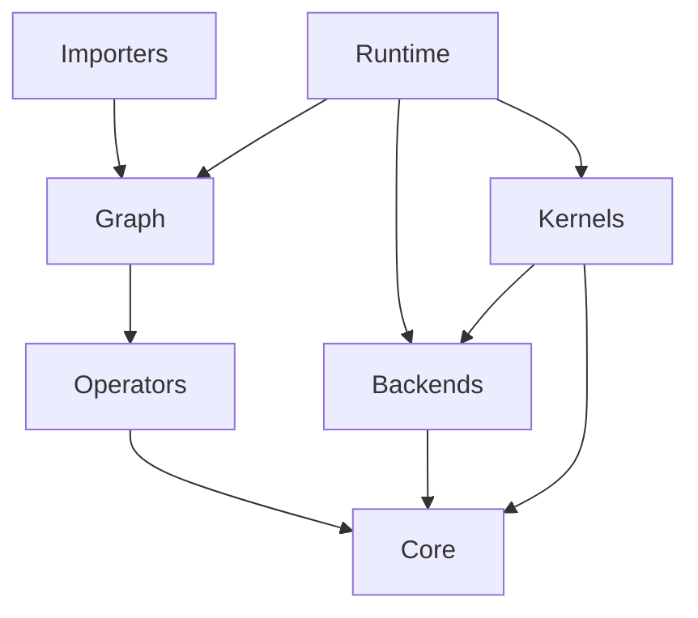

# Mini-Infer 项目结构说明

本文档详细说明了 Mini-Infer 项目的目录结构和文件组织。

## 顶层目录结构

```
Mini-Infer/
├── CMakeLists.txt          # 顶层 CMake 配置文件
├── CMakeUserPresets.json   # 用户自定义 CMake 预设（可选）
├── conanfile.py            # Conan 包配置文件
├── README.md               # 项目说明文档
├── QUICK_START.md          # 快速开始指南
├── LICENSE                 # MIT 许可证
├── PROJECT_STRUCTURE.md    # 本文件
├── include/                # 公共头文件目录
├── src/                    # 源代码实现目录
├── tests/                  # 测试代码目录
├── examples/               # 示例代码目录
├── docs/                   # 文档目录
├── models/                 # 模型文件和训练脚本
└── build/                  # 构建目录（由 Conan 生成）
    ├── Debug/              # Debug 构建
    ├── Release/            # Release 构建
    └── generators/         # Conan 生成的文件
        ├── CMakePresets.json      # 自动生成的 CMake 预设
        ├── conan_toolchain.cmake  # Conan 工具链
        └── CMakeDeps.cmake        # 依赖配置
```

## include/ - 头文件目录

公共 API 头文件，按模块组织：

```
include/mini_infer/
├── mini_infer.h           # 主头文件
├── core/                  # Core 模块 (数据结构)
│   ├── tensor.h           # Tensor, Storage 类
│   ├── allocator.h        # Aligned Allocator
│   └── types.h            # 基础类型 (DataType, DeviceType)
├── runtime/               # Runtime 模块 (推理引擎)
│   ├── engine.h           # Engine 门面
│   ├── inference_plan.h   # 推理计划 (Static)
│   ├── execution_context.h # 执行上下文 (Dynamic)
│   └── memory_planner.h   # 静态内存规划器
├── graph/                 # Graph 模块 (拓扑)
│   ├── node.h             # Node (包含 Port 定义)
│   └── graph.h            # Graph 容器
├── backends/              # Backends 模块 (执行环境)
│   └── device_context.h   # 设备上下文基类
├── kernels/               # Kernels 模块 (计算核心)
│   ├── kernel_registry.h  # 注册表与分发器
│   └── cpu/               # CPU Kernel 声明
└── importers/             # Importers 模块 (前端)
    └── onnx_parser.h      # ONNX 解析器
```

## src/ - 源代码目录

实现文件，与头文件结构对应：

```
src/
├── core/                  # Core 实现
├── runtime/               # Runtime 实现
│   ├── engine.cpp
│   ├── inference_plan.cpp
│   ├── execution_context.cpp
│   └── memory_planner.cpp
├── graph/                 # Graph 实现
├── backends/              # Backends 实现
│   └── cpu/               # CPU DeviceContext 实现
├── kernels/               # Kernels 实现 (重点)
│   ├── kernel_registry.cpp
│   └── cpu/               # 具体 CPU 算子实现
│       ├── conv2d_cpu.cpp
│       ├── relu_cpu.cpp
│       ├── pooling_cpu.cpp
│       └── ...
├── operators/             # Operators 实现 (Metadata & Shape Infer)
│   ├── conv2d.cpp
│   └── ...
├── importers/             # Importers 实现
    └── internal/          # 内部实现 (Pimpl)
        └── onnx_graph_builder.cpp
```

## 关键模块职责

### 1. Runtime
运行时的大脑。
- **Engine**: 用户接口。
- **InferencePlan**: 编译期产物，包含优化后的图和内存偏移量表。
- **ExecutionContext**: 运行期产物，持有实际的内存池和 Tensor 实例。

### 2. Kernels
计算的核心。这里的代码不做任何图相关的逻辑，只负责数学运算。
- **Registry**: 负责根据 `{OpType, DeviceType, DataType}` 找到正确的函数指针。
- **CPU Kernels**: 实现具体的计算逻辑（未来会增加 `src/kernels/cuda/`）。

### 3. Core
基础数据结构。
- **Tensor**: 实现了 View 机制，Metadata 与 Data 分离。
- **Storage**: 管理原始内存块，支持引用计数。

### 4. Operators
算子的元数据中心。
- 负责定义算子有哪些参数（如 Conv 的 stride/padding）。
- 负责在编译期推导 Shape。
- **不包含**任何计算逻辑（计算逻辑全部移到了 Kernels）。

## 依赖关系



## 构建产物

*   `mini_infer_core`: 基础库
*   `mini_infer_runtime`: 引擎库（包含 Graph, Backends 等）
*   `mini_infer_kernels`: 算子库
*   `mini_infer_importers`: ONNX 解析库

通常用户只需链接 `mini_infer_runtime` 和 `mini_infer_importers` 即可。
