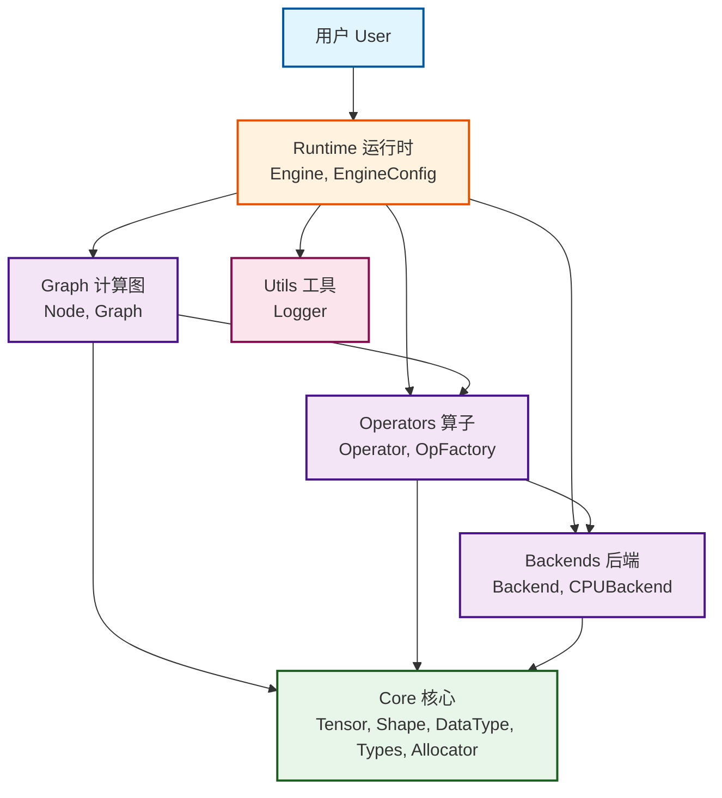
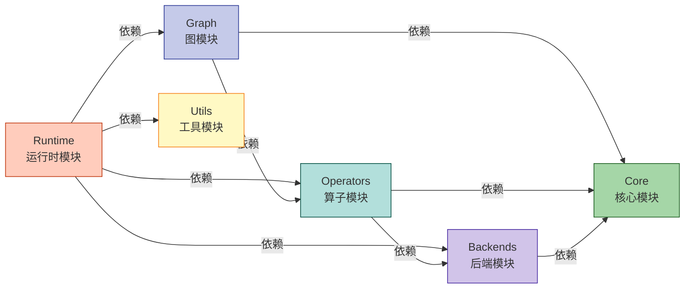

# Mini-Infer

一个轻量级的深度学习推理框架，类似于 TensorRT，支持高性能模型推理。

## 项目特性

- 🚀 **模块化设计**: 清晰的模块划分，便于维护和扩展
- 🔧 **可扩展后端**: 抽象的后端接口，支持 CPU 和未来的 GPU（CUDA）后端
- 📊 **计算图**: 完整的计算图表示和优化
- ⚡ **高性能**: 面向性能优化的设计
- 🧪 **易于测试**: 完善的测试框架

## 项目结构

```
Mini-Infer/
├── include/                # 公共头文件
│   └── mini_infer/
│       ├── core/          # 核心数据结构（Tensor, Allocator等）
│       ├── backends/      # 后端抽象层（CPU, CUDA）
│       ├── operators/     # 算子实现
│       ├── graph/         # 计算图
│       ├── runtime/       # 运行时引擎
│       └── utils/         # 工具类
├── src/                   # 源文件实现
│   ├── core/
│   ├── backends/
│   ├── operators/
│   ├── graph/
│   ├── runtime/
│   └── utils/
├── tests/                 # 测试
├── examples/              # 示例代码
├── docs/                  # 文档
└── CMakeLists.txt         # CMake 配置文件
```

## 构建要求

### 基础依赖

- CMake 3.18+
- C++17 编译器
  - MSVC 2017+ (Windows)
  - GCC 7+ (Linux)
  - Clang 5+ (macOS)

### 推荐：使用 Conan 包管理器（跨平台）

**强烈推荐使用 Conan 进行依赖管理**，它提供真正的跨平台一键式构建体验：

```bash
# 安装 Conan (所有平台)
pip install conan

# 初始化 Conan profile
conan profile detect --force
```

使用 Conan 后，所有依赖（包括 Protobuf）都会自动下载和配置，无需手动安装！

详细说明请参考：[Conan 构建指南](docs/CONAN_BUILD_GUIDE.md)

## 快速开始

### 构建项目

#### 🚀 方式 1: 使用 Conan（推荐，跨平台一键式）

**Windows:**
```powershell
# 使用自动化脚本（推荐，一键完成所有步骤）
.\build.ps1

# 或手动执行（Debug 构建 + ONNX 支持）
# 步骤 1: 安装依赖（使用默认输出目录）
conan install . -s build_type=Debug -o enable_onnx=True --build=missing

# 步骤 2: 配置 CMake（自动使用 Conan 生成的预设）
cmake --preset conan-debug

# 步骤 3: 编译
cmake --build build/Debug

# 步骤 4: 运行示例
.\build\Debug\bin\onnx_parser_example.exe .\models\python\lenet5\models\lenet5.onnx

# Release 构建
conan install . -s build_type=Release -o enable_onnx=True --build=missing
cmake --preset conan-release
cmake --build build/Release
```

**Linux/macOS:**
```bash
# 使用自动化脚本（推荐，一键完成所有步骤）
chmod +x build.sh
./build.sh

# 或手动执行（Debug 构建 + ONNX 支持）
# 步骤 1: 安装依赖（使用默认输出目录）
conan install . -s build_type=Debug -o enable_onnx=True --build=missing

# 步骤 2: 配置 CMake（自动使用 Conan 生成的预设）
cmake --preset conan-debug

# 步骤 3: 编译
cmake --build build/Debug

# 步骤 4: 运行示例
./build/Debug/bin/onnx_parser_example ./models/python/lenet5/models/lenet5.onnx

# Release 构建
conan install . -s build_type=Release -o enable_onnx=True --build=missing
cmake --preset conan-release
cmake --build build/Release
```

**🎉 Conan 优势:**
- ✅ **真正的跨平台**: Windows/Linux/macOS 完全相同的命令
- ✅ **自动依赖管理**: 自动下载和配置 Protobuf、Abseil 等所有依赖
- ✅ **自动 ONNX 配置**: 自动下载 proto 文件、生成 C++ 代码
- ✅ **选项自动传递**: `-o enable_onnx=True` 自动转换为 `MINI_INFER_ENABLE_ONNX=ON`
- ✅ **零手动配置**: 一条命令搞定所有事情
- ✅ **可重现构建**: 锁定依赖版本，确保一致性

**⚡ 自动化脚本特性:**

- ✅ **智能 Ninja 检测**: 自动检测并建议安装 Ninja 生成器（提升 50%+ 编译速度）
- ✅ **自动依赖管理**: 一键安装所有依赖
- ✅ **灵活配置**: 支持所有 Conan 选项

**参数说明:**
- **Windows**: `.\build.ps1 [-BuildType Debug|Release] [-Clean] [-Test] [-Install]`
- **Linux/macOS**: `./build.sh [-d|-r] [-c] [-t] [-i] [--no-onnx] [--enable-cuda]`

示例：
```powershell
# Windows: Release 构建 + 运行测试
.\build.ps1 -BuildType Release -Test

# Linux: Release 构建 + 清理 + 安装
./build.sh -r -c -i
```

详见：[快速开始指南](QUICK_START.md) | [Conan 构建指南](docs/CONAN_BUILD_GUIDE.md)

#### 方式 2: 传统构建（基础功能，不含 ONNX）

**Windows:**
```powershell
mkdir build && cd build
cmake .. -DMINI_INFER_ENABLE_ONNX=OFF
cmake --build . --config Release
```

**Linux/macOS:**
```bash
mkdir build && cd build
cmake -DCMAKE_BUILD_TYPE=Release -DMINI_INFER_ENABLE_ONNX=OFF ..
make -j$(nproc)
```

### CMake 预设

Conan 会自动生成 CMake 预设，无需手动配置：

#### 可用预设（由 Conan 自动生成）

- `conan-debug` - Debug 构建
- `conan-release` - Release 构建

#### 使用流程

```bash
# 1. Conan 安装依赖（自动生成预设）
conan install . -s build_type=Debug -o enable_onnx=True --build=missing

# 2. 使用生成的预设配置 CMake
cmake --preset conan-debug

# 3. 构建项目
cmake --build build/Debug

# 4. 运行测试
ctest --preset conan-debug
```

**说明：**
- Conan 会根据 `build_type` 自动生成对应的预设
- 预设包含了所有依赖路径、编译选项和工具链配置
- `-o enable_onnx=True` 等选项会自动传递到 CMake

### 运行测试

```bash
# 使用 Conan 生成的预设运行测试
ctest --preset conan-debug     # Debug 构建
ctest --preset conan-release   # Release 构建

# 或传统方式
cd build/Debug
ctest --output-on-failure
```

### 运行示例

```bash
# Windows
.\bin\Release\simple_inference.exe
.\bin\Release\build_graph.exe

# Linux/macOS
./bin/simple_inference
./bin/build_graph
```

## 编译选项

在运行 cmake 时，可以使用以下选项：

```bash
cmake .. \
  -DMINI_INFER_BUILD_TESTS=ON \        # 构建测试（默认 ON）
  -DMINI_INFER_BUILD_EXAMPLES=ON \     # 构建示例（默认 ON）
  -DMINI_INFER_BUILD_SHARED_LIBS=ON \  # 构建动态库（默认 ON）
  -DMINI_INFER_ENABLE_CUDA=OFF \       # 启用 CUDA（默认 OFF，未来支持）
  -DMINI_INFER_ENABLE_ONNX=ON \        # 启用 ONNX 模型导入（默认 ON）
  -DMINI_INFER_ENABLE_PROFILING=ON \   # 启用性能分析（默认 ON）
  -DMINI_INFER_ENABLE_LOGGING=ON       # 启用日志（默认 ON）
```

### ONNX 相关选项

- **`MINI_INFER_ENABLE_ONNX=ON`**: 启用 ONNX 模型导入支持
  - 需要先安装 Protobuf 依赖
  - Windows 推荐使用 vcpkg 安装
  - 如果 Protobuf 未找到，会自动禁用 ONNX 支持并显示警告

## 使用示例

### 创建张量

```cpp
#include "mini_infer/core/tensor.h"

using namespace mini_infer;

// 创建一个形状为 [1, 3, 224, 224] 的张量
core::Shape shape({1, 3, 224, 224});
auto tensor = core::Tensor::create(shape, core::DataType::FLOAT32);

// 访问数据
float* data = static_cast<float*>(tensor->data());
```

### 构建计算图

```cpp
#include "mini_infer/graph/graph.h"

using namespace mini_infer;

// 创建图
auto graph = std::make_shared<graph::Graph>();

// 添加节点
auto input = graph->create_node("input");
auto conv1 = graph->create_node("conv1");
auto output = graph->create_node("output");

// 连接节点
graph->connect("input", "conv1");
graph->connect("conv1", "output");

// 设置输入输出
graph->set_inputs({"input"});
graph->set_outputs({"output"});
```

### ONNX 模型导入

```cpp
#include "mini_infer/importers/onnx_parser.h"
#include "mini_infer/runtime/runtime.h"

using namespace mini_infer;

int main() {
    // 1. 解析 ONNX 模型
    importers::OnnxParser parser;
    parser.set_verbose(true);  // 启用详细日志
    
    auto graph = parser.parse("model.onnx");
    if (!graph) {
        std::cerr << "Failed to parse ONNX model: " 
                  << parser.get_error() << std::endl;
        return 1;
    }
    
    // 2. 创建运行时
    runtime::Runtime runtime;
    if (!runtime.load_graph(std::move(graph))) {
        std::cerr << "Failed to load graph" << std::endl;
        return 1;
    }
    
    // 3. 准备输入数据
    std::vector<float> input_data(1 * 3 * 224 * 224);
    // ... 填充输入数据 ...
    
    // 4. 执行推理
    auto outputs = runtime.forward({input_data});
    
    // 5. 处理输出
    for (const auto& output : outputs) {
        std::cout << "Output size: " << output.size() << std::endl;
    }
    
    return 0;
}
```

**注意**: ONNX 功能需要在编译时启用 `-DMINI_INFER_ENABLE_ONNX=ON` 并安装 Protobuf 依赖。

### 运行推理

```cpp
#include "mini_infer/runtime/engine.h"

using namespace mini_infer;

// 配置引擎
runtime::EngineConfig config;
config.device_type = core::DeviceType::CPU;

// 创建引擎
runtime::Engine engine(config);

// 构建
engine.build(graph);

// 准备输入
std::unordered_map<std::string, std::shared_ptr<core::Tensor>> inputs;
inputs["input"] = input_tensor;

// 执行推理
std::unordered_map<std::string, std::shared_ptr<core::Tensor>> outputs;
engine.forward(inputs, outputs);
```

## 架构设计

### 组件架构图



### 模块依赖关系



### 核心模块

- **Core**: 提供基础数据结构（Tensor, Shape, Allocator）
- **Backends**: 抽象的后端接口，支持不同硬件加速
- **Operators**: 各种算子的实现（Conv2D, Pooling, Activation等）
- **Graph**: 计算图的表示和优化
- **Runtime**: 推理引擎，负责执行计算图
- **Utils**: 日志、性能分析等工具

> 💡 **更多架构细节**: 查看 [完整组件图文档](docs/COMPONENT_DIAGRAM.md) 了解详细的组件交互、数据流和扩展点

## 开发路线

- [x] 基础框架搭建
- [x] CPU 后端实现
- [ ] 常用算子实现（Conv2D, ReLU, MaxPool等）
- [ ] 图优化（算子融合、常量折叠）
- [ ] 模型格式支持（ONNX）
- [ ] CUDA 后端支持
- [ ] 性能优化（SIMD、多线程）
- [ ] FP16 支持
- [ ] INT8 量化支持

## 贡献

欢迎提交 Issue 和 Pull Request！

## 许可证

MIT License

## 作者

James

## 致谢

本项目受 TensorRT 启发，旨在学习和理解推理框架的设计原理。

