# Mini-Infer

一个轻量级的深度学习推理框架，类似于 TensorRT，支持高性能模型推理。

## 项目特性

- 🚀 **模块化设计**: 清晰的模块划分，便于维护和扩展
- 🔧 **可扩展后端**: 抽象的后端接口，支持 CPU 和未来的 GPU（CUDA）后端
- 📊 **计算图**: 完整的计算图表示和优化
- ⚡ **高性能**: 面向性能优化的设计
- 🧪 **易于测试**: 完善的测试框架

## 项目结构

```
Mini-Infer/
├── include/                # 公共头文件
│   └── mini_infer/
│       ├── core/          # 核心数据结构（Tensor, Allocator等）
│       ├── backends/      # 后端抽象层（CPU, CUDA）
│       ├── operators/     # 算子实现
│       ├── graph/         # 计算图
│       ├── runtime/       # 运行时引擎
│       └── utils/         # 工具类
├── src/                   # 源文件实现
│   ├── core/
│   ├── backends/
│   ├── operators/
│   ├── graph/
│   ├── runtime/
│   └── utils/
├── tests/                 # 测试
├── examples/              # 示例代码
├── docs/                  # 文档
└── CMakeLists.txt         # CMake 配置文件
```

## 构建要求

- CMake 3.18+
- C++17 编译器
  - MSVC 2017+ (Windows)
  - GCC 7+ (Linux)
  - Clang 5+ (macOS)

## 快速开始

### 构建项目

#### Windows (MSVC)

```powershell
mkdir build
cd build
cmake ..
cmake --build . --config Release
```

#### Linux/macOS

```bash
mkdir build
cd build
cmake -DCMAKE_BUILD_TYPE=Release ..
make -j$(nproc)
```

### 运行测试

```bash
cd build
ctest --output-on-failure
```

### 运行示例

```bash
# Windows
.\bin\Release\simple_inference.exe
.\bin\Release\build_graph.exe

# Linux/macOS
./bin/simple_inference
./bin/build_graph
```

## 编译选项

在运行 cmake 时，可以使用以下选项：

```bash
cmake .. \
  -DMINI_INFER_BUILD_TESTS=ON \        # 构建测试（默认 ON）
  -DMINI_INFER_BUILD_EXAMPLES=ON \     # 构建示例（默认 ON）
  -DMINI_INFER_BUILD_SHARED_LIBS=ON \  # 构建动态库（默认 ON）
  -DMINI_INFER_ENABLE_CUDA=OFF \       # 启用 CUDA（默认 OFF，未来支持）
  -DMINI_INFER_ENABLE_PROFILING=ON \   # 启用性能分析（默认 ON）
  -DMINI_INFER_ENABLE_LOGGING=ON       # 启用日志（默认 ON）
```

## 使用示例

### 创建张量

```cpp
#include "mini_infer/core/tensor.h"

using namespace mini_infer;

// 创建一个形状为 [1, 3, 224, 224] 的张量
core::Shape shape({1, 3, 224, 224});
auto tensor = core::Tensor::create(shape, core::DataType::FLOAT32);

// 访问数据
float* data = static_cast<float*>(tensor->data());
```

### 构建计算图

```cpp
#include "mini_infer/graph/graph.h"

using namespace mini_infer;

// 创建图
auto graph = std::make_shared<graph::Graph>();

// 添加节点
auto input = graph->create_node("input");
auto conv1 = graph->create_node("conv1");
auto output = graph->create_node("output");

// 连接节点
graph->connect("input", "conv1");
graph->connect("conv1", "output");

// 设置输入输出
graph->set_inputs({"input"});
graph->set_outputs({"output"});
```

### 运行推理

```cpp
#include "mini_infer/runtime/engine.h"

using namespace mini_infer;

// 配置引擎
runtime::EngineConfig config;
config.device_type = core::DeviceType::CPU;

// 创建引擎
runtime::Engine engine(config);

// 构建
engine.build(graph);

// 准备输入
std::unordered_map<std::string, std::shared_ptr<core::Tensor>> inputs;
inputs["input"] = input_tensor;

// 执行推理
std::unordered_map<std::string, std::shared_ptr<core::Tensor>> outputs;
engine.forward(inputs, outputs);
```

## 架构设计

### 组件架构图

```mermaid
graph TB
    %% 用户层
    User[用户 User]
    
    %% Runtime 层
    Runtime[Runtime 运行时<br/>Engine, EngineConfig]
    
    %% 中间层组件
    Graph[Graph 计算图<br/>Node, Graph]
    Backends[Backends 后端<br/>Backend, CPUBackend]
    Operators[Operators 算子<br/>Operator, OpFactory]
    
    %% 核心层
    Core[Core 核心<br/>Tensor, Shape, DataType, Types, Allocator]
    
    %% 工具层
    Utils[Utils 工具<br/>Logger]
    
    %% 依赖关系
    User --> Runtime
    Runtime --> Graph
    Runtime --> Backends
    Runtime --> Operators
    Runtime --> Utils
    
    Graph --> Operators
    Graph --> Core
    
    Operators --> Backends
    Operators --> Core
    
    Backends --> Core
    
    %% 样式定义
    classDef userStyle fill:#e1f5ff,stroke:#01579b,stroke-width:2px
    classDef runtimeStyle fill:#fff3e0,stroke:#e65100,stroke-width:2px
    classDef componentStyle fill:#f3e5f5,stroke:#4a148c,stroke-width:2px
    classDef coreStyle fill:#e8f5e9,stroke:#1b5e20,stroke-width:2px
    classDef utilStyle fill:#fce4ec,stroke:#880e4f,stroke-width:2px
    
    class User userStyle
    class Runtime runtimeStyle
    class Graph,Backends,Operators componentStyle
    class Core coreStyle
    class Utils utilStyle
```



### 模块依赖关系

```mermaid
graph LR
    Runtime[Runtime<br/>运行时模块]
    Graph[Graph<br/>图模块]
    Operators[Operators<br/>算子模块]
    Backends[Backends<br/>后端模块]
    Core[Core<br/>核心模块]
    Utils[Utils<br/>工具模块]
    
    Runtime -->|依赖| Graph
    Runtime -->|依赖| Backends
    Runtime -->|依赖| Operators
    Runtime -->|依赖| Utils
    
    Graph -->|依赖| Operators
    Graph -->|依赖| Core
    
    Operators -->|依赖| Backends
    Operators -->|依赖| Core
    
    Backends -->|依赖| Core
    
    style Runtime fill:#ffccbc,stroke:#bf360c
    style Graph fill:#c5cae9,stroke:#283593
    style Operators fill:#b2dfdb,stroke:#004d40
    style Backends fill:#d1c4e9,stroke:#4527a0
    style Core fill:#a5d6a7,stroke:#1b5e20
    style Utils fill:#fff9c4,stroke:#f57f17
```



### 核心模块

- **Core**: 提供基础数据结构（Tensor, Shape, Allocator）
- **Backends**: 抽象的后端接口，支持不同硬件加速
- **Operators**: 各种算子的实现（Conv2D, Pooling, Activation等）
- **Graph**: 计算图的表示和优化
- **Runtime**: 推理引擎，负责执行计算图
- **Utils**: 日志、性能分析等工具

> 💡 **更多架构细节**: 查看 [完整组件图文档](docs/COMPONENT_DIAGRAM.md) 了解详细的组件交互、数据流和扩展点

## 开发路线

- [x] 基础框架搭建
- [x] CPU 后端实现
- [ ] 常用算子实现（Conv2D, ReLU, MaxPool等）
- [ ] 图优化（算子融合、常量折叠）
- [ ] 模型格式支持（ONNX）
- [ ] CUDA 后端支持
- [ ] 性能优化（SIMD、多线程）
- [ ] FP16 支持
- [ ] INT8 量化支持

## 贡献

欢迎提交 Issue 和 Pull Request！

## 许可证

MIT License

## 作者

James

## 致谢

本项目受 TensorRT 启发，旨在学习和理解推理框架的设计原理。

