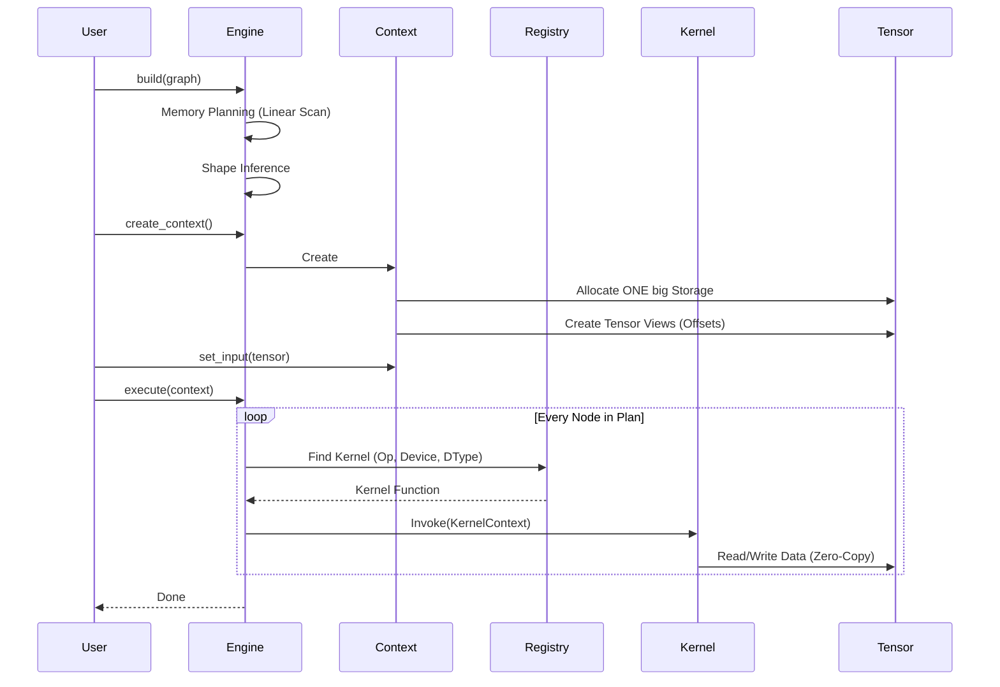

# Mini-Infer 组件图 (Component Diagram)

本文档展示了 Mini-Infer 深度学习推理框架的最新组件架构。

## 1. 总体组件图

```mermaid
graph TB
    %% 用户层
    User[用户 User]
    
    %% Runtime 层
    subgraph Runtime
        Engine[Engine<br/>(API Facade)]
        Plan[InferencePlan<br/>(Static, Read-Only)]
        Context[ExecutionContext<br/>(Dynamic, Per-Request)]
        Planner[MemoryPlanner]
        ShapeInfer[ShapeInferenceEngine]
    end

    %% Kernels 层
    subgraph Kernels
        Registry[KernelRegistry]
        Dispatcher[Dispatcher]
        CPUKernels[CPU Kernels<br/>(Conv, ReLU...)]
        CUDAKernels[CUDA Kernels<br/>(Future)]
    end
    
    %% Graph 层
    subgraph GraphLayer
        Graph[Graph]
        Node[Node<br/>(Port-Based)]
    end
    
    %% Operators 层
    subgraph OperatorsLayer
        Ops[Operators<br/>(Metadata Only)]
    end

    %% Backends 层
    subgraph Backends
        DevContext[DeviceContext]
        CPUCtx[CPUDeviceContext]
    end
    
    %% Core 层
    subgraph Core
        Tensor[Tensor<br/>(View Mechanism)]
        Storage[Storage<br/>(Raw Memory)]
        Allocator[Allocator]
    end
    
    %% Importers 层
    subgraph Importers
        OnnxParser[OnnxParser]
        ModelImporter[ModelImporter]
    end

    %% 依赖关系
    User --> Engine
    User --> OnnxParser
    
    Engine --> Plan
    Engine --> Context
    
    Plan --> Graph
    Plan --> Planner
    Plan --> ShapeInfer
    
    Context --> Storage
    Context --> Tensor
    Context --> DevContext
    
    Context --> Registry
    Registry --> CPUKernels
    Registry --> CUDAKernels
    
    CPUKernels --> DevContext
    CPUKernels --> Tensor
    
    OnnxParser --> ModelImporter
    ModelImporter --> Graph
    
    Graph --> Ops
    Ops --> Core
    
    %% 样式定义
    classDef runtimeStyle fill:#fff3e0,stroke:#e65100,stroke-width:2px
    classDef kernelStyle fill:#e3f2fd,stroke:#1565c0,stroke-width:2px
    classDef coreStyle fill:#e8f5e9,stroke:#1b5e20,stroke-width:2px
    
    class Runtime,Engine,Plan,Context runtimeStyle
    class Kernels,Registry,CPUKernels kernelStyle
    class Core,Tensor,Storage coreStyle
```

## 2. 核心交互流程: 推理 (Inference Flow)



## 3. 模块职责矩阵

| 模块 | 核心组件 | 职责 | 线程安全性 |
| :--- | :--- | :--- | :--- |
| **Runtime** | `Engine`, `InferencePlan`, `ExecutionContext` | 编排推理流程，管理生命周期，静态规划 | Plan: 安全<br>Context: 不安全 |
| **Kernels** | `KernelRegistry`, `CPUKernels` | 执行具体的数学运算（无状态） | 安全 (Reentrant) |
| **Core** | `Tensor`, `Storage`, `Allocator` | 基础数据结构，内存管理 | 安全 |
| **Backends** | `DeviceContext` | 提供执行环境（如 ThreadPool, CUDA Stream） | 安全 (TLS) |
| **Graph** | `Graph`, `Node` | 描述计算拓扑，支持 Port 级连接 | 不安全 (构建时) |
| **Operators** | `Conv2D`, `ReLU`... | 仅存储参数（如 stride），推导 Shape | 安全 (Const) |

## 4. 关键架构决策

1.  **Plan/Context 分离**:
    *   为了支持高并发推理，我们将所有不可变的状态（图结构、权重、内存规划表）提取到 `InferencePlan` 中。
    *   所有可变状态（Tensor 数据、中间变量）放在 `ExecutionContext` 中。
    *   **结果**: 这里实现了类似 TensorRT 的运行时架构。

2.  **Kernel Registry 机制**:
    *   摒弃了虚函数多态（`Op->forward()`），改用注册表分发。
    *   **优点**: 彻底解耦了算子定义与硬件实现。添加新硬件支持只需注册新 Kernel，无需修改算子类。

3.  **静态内存规划 (Linear Scan)**:
    *   在编译期计算每个 Tensor 的生存期。
    *   使用贪心算法将不重叠的 Tensor 映射到同一块物理内存。
    *   **收益**: 这种 "Arena" 风格的分配方式将内存碎片降至最低，且运行时分配开销为 O(1)。
