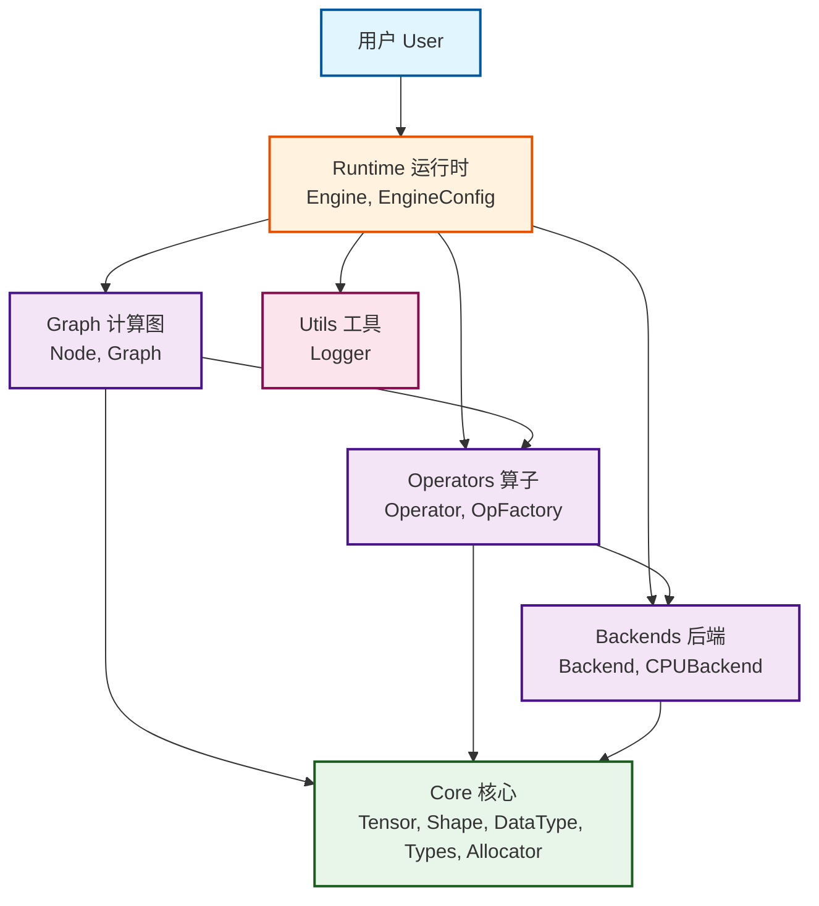
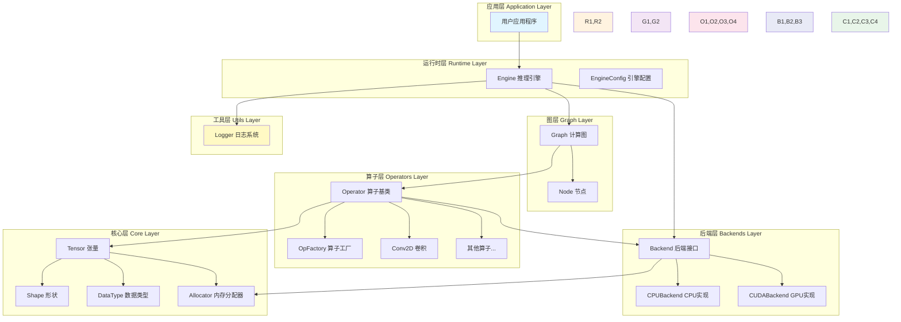
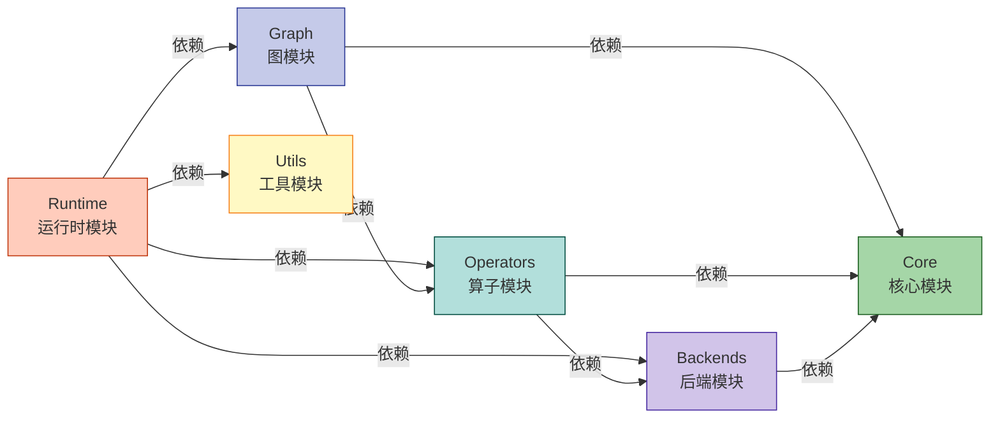
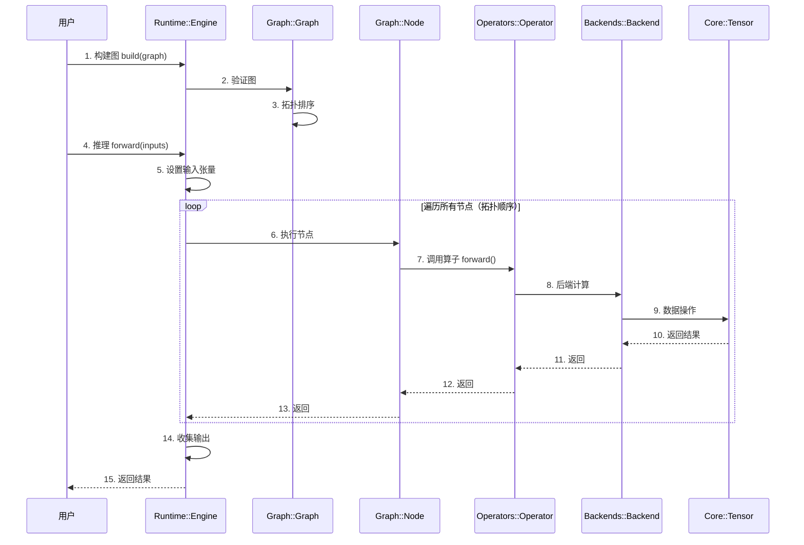
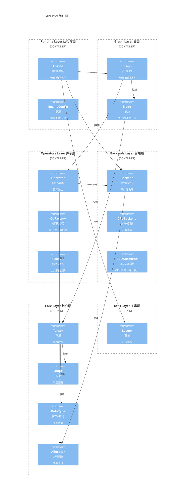
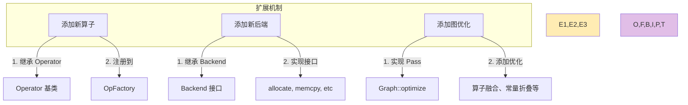
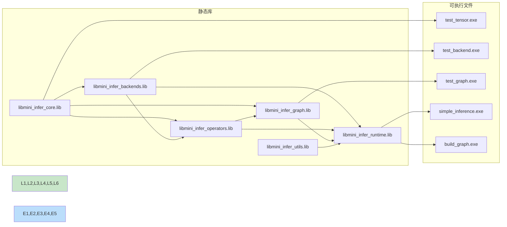
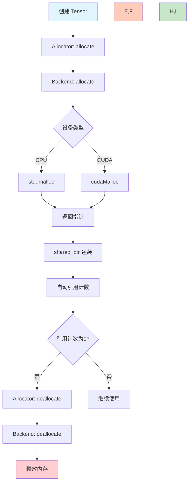
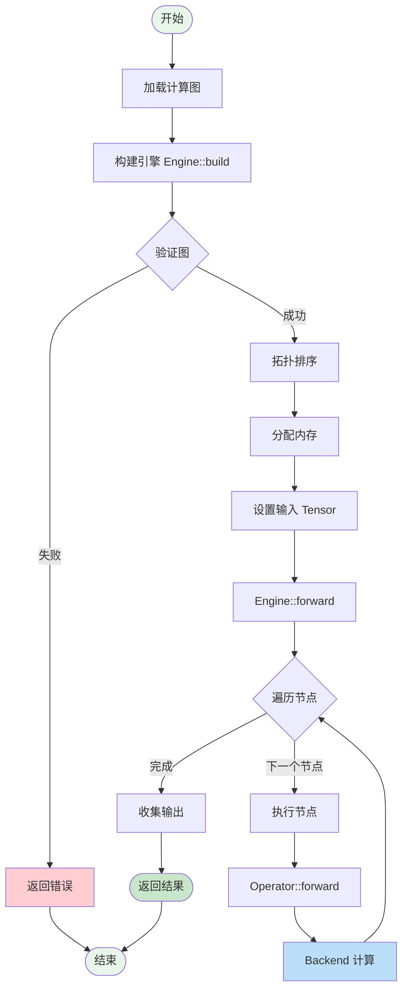

# Mini-Infer 组件图 (Component Diagram)

本文档展示了 Mini-Infer 深度学习推理框架的组件架构。

## 1. 总体组件图



## 2. 分层架构图



## 3. 模块依赖关系图



## 4. 数据流图



## 5. UML 组件图



## 6. 组件接口说明

### Core 核心层
- **Tensor**: 多维数组，支持不同数据类型和设备
  - `create()`: 创建张量
  - `data()`: 获取数据指针
  - `shape()`: 获取形状
  - `dtype()`: 获取数据类型
- **Shape**: 张量形状表示
  - `dims()`: 获取维度数组
  - `size()`: 计算元素总数
- **DataType**: 数据类型枚举（FLOAT32, INT32等）
- **Allocator**: 内存分配器接口
  - `allocate()`: 分配内存
  - `deallocate()`: 释放内存

### Backends 后端层
- **Backend**: 硬件抽象接口
  - `allocate()`: 分配内存
  - `deallocate()`: 释放内存
  - `memcpy()`: 数据拷贝
  - `synchronize()`: 同步
- **CPUBackend**: CPU 后端实现
- **CUDABackend**: CUDA 后端实现（待开发）

### Operators 算子层
- **Operator**: 算子基类
  - `forward()`: 前向计算
  - `infer_shape()`: 形状推断
- **OpFactory**: 算子工厂，负责注册和创建算子
  - `create()`: 创建算子实例
  - `register_op()`: 注册算子
- **Conv2D**: 2D 卷积算子

### Graph 图层
- **Node**: 计算图节点
  - 包含算子
  - 管理输入输出张量
- **Graph**: 计算图
  - `create_node()`: 创建节点
  - `connect()`: 连接节点
  - `topological_sort()`: 拓扑排序
  - `validate()`: 验证图的有效性

### Runtime 运行时层
- **Engine**: 推理引擎
  - `build()`: 构建引擎
  - `forward()`: 执行推理
- **EngineConfig**: 引擎配置
  - 设备类型
  - 优化选项

### Utils 工具层
- **Logger**: 日志系统
  - 支持不同日志级别（DEBUG, INFO, WARNING, ERROR）
  - 格式化输出

## 7. 扩展点



### 7.1 添加新算子示例

```cpp
// 1. 定义算子类
class ReLUOperator : public Operator {
public:
    Status forward(const std::vector<std::shared_ptr<Tensor>>& inputs,
                   std::vector<std::shared_ptr<Tensor>>& outputs,
                   Backend* backend) override {
        // 实现 ReLU 计算
        return Status::SUCCESS;
    }
    
    Status infer_shape(const std::vector<Shape>& input_shapes,
                       std::vector<Shape>& output_shapes) override {
        // 形状推断：ReLU 不改变形状
        output_shapes = input_shapes;
        return Status::SUCCESS;
    }
};

// 2. 注册算子
REGISTER_OPERATOR(ReLU, ReLUOperator);
```

### 7.2 添加新后端示例

```cpp
// 1. 实现 Backend 接口
class CUDABackend : public Backend {
public:
    void* allocate(size_t size) override {
        void* ptr = nullptr;
        cudaMalloc(&ptr, size);
        return ptr;
    }
    
    void deallocate(void* ptr) override {
        cudaFree(ptr);
    }
    
    void memcpy(void* dst, const void* src, size_t size,
                MemcpyKind kind) override {
        // 实现 CUDA 内存拷贝
    }
    
    void synchronize() override {
        cudaDeviceSynchronize();
    }
};

// 2. 在 BackendFactory 中注册
```

## 8. 构建产物



## 9. 内存管理流程



## 10. 推理执行流程



---

## 说明

- **实线箭头**: 表示依赖关系（uses/depends on）
- **虚线箭头**: 表示创建关系（creates）
- **包含关系**: 表示模块包含子组件

## 如何查看

这些图使用 Mermaid 语法编写，可以在以下环境中渲染：

1. **GitHub**: 直接在 GitHub 上查看此 Markdown 文件
2. **VS Code**: 安装 Mermaid 预览插件
   - 推荐插件: "Markdown Preview Mermaid Support"
3. **在线工具**: 使用 [Mermaid Live Editor](https://mermaid.live/)
4. **文档生成**: MkDocs, GitBook 等支持 Mermaid 的文档工具

## 相关文档

- [架构设计文档](ARCHITECTURE.md) - 详细的架构说明
- [API 文档](API.md) - API 参考
- [构建指南](BUILD.md) - 如何构建项目
- [快速入门](GETTING_STARTED.md) - 入门教程

---

最后更新: 2025-11-16
