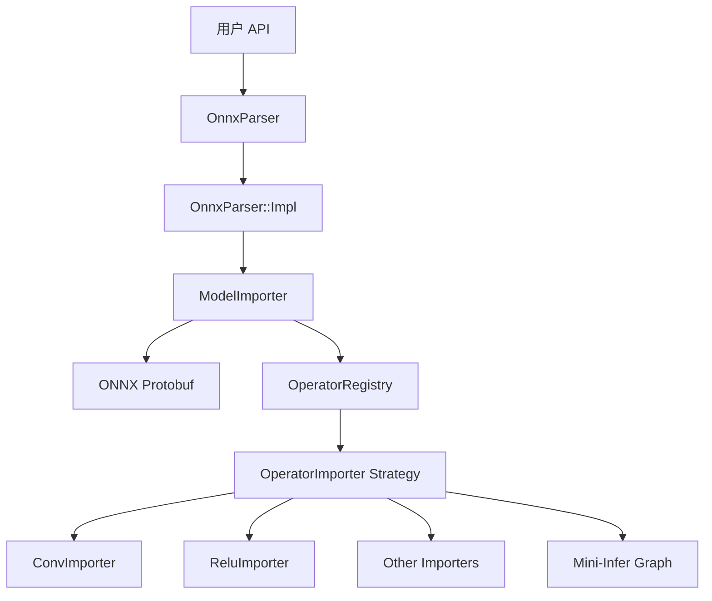

# ONNX Model Importer 实现文档

Mini-Infer 配备了一个成熟的 ONNX 模型导入器，能够将标准的 ONNX 模型自动转换为内部的计算图 (`graph::Graph`)。

## 核心设计 (Core Design)

Importer 采用 **ModelImporter -> OperatorImporter** 的两级分发架构，并利用 **Pimpl (Pointer to Implementation)** 惯用语来隔离 Protobuf 依赖。

### 1. 架构图



### 2. 关键组件

#### OnnxParser
用户可见的 API 类。
*   **ABI 安全**: 类成员只有一个 `std::unique_ptr<Impl>`，确保库的二进制接口不依赖于 Protobuf 版本。

#### ModelImporter
负责解析整个 `ModelProto`。
*   **Graph 构建**: 初始化 `graph::Graph` 对象。
*   **Initializer 处理**: 解析 `GraphProto.initializer`，将其转换为 `core::Tensor` 并设为 Graph 的权重。
*   **拓扑构建**: 遍历 `NodeProto`，维护 `tensor_name -> (Node*, output_port)` 的映射表，确保正确连接。

#### OperatorImporter
这是一个接口类（策略模式），每个具体的 ONNX 算子（如 `Conv`, `Relu`）都有一个对应的实现。

```cpp
class OperatorImporter {
public:
    virtual Status import(
        ImporterContext& ctx, 
        const onnx::NodeProto& node, 
        graph::Graph& graph
    ) = 0;
};
```

### 3. Graph 构建细节 (Graph Construction)

在最新的架构中，Graph 支持基于端口 (Port) 的连接。Importer 必须正确处理这一点：

1.  **输入映射**: 当解析到一个 Node 时，根据其 `input` 名字在 `tensor_map` 中查找来源。
    *   来源可能是一个 Graph Input。
    *   来源可能是另一个 Node 的某个 Output Port。
2.  **节点创建**: 创建对应的 Mini-Infer Node，并设置 Operator 参数。
3.  **连接**: 调用 `graph->connect(src_node, dst_node, src_port, dst_port)`。
4.  **输出注册**: 将当前 Node 的每个 `output` 名字与 `(current_node, output_port_index)` 绑定，存入 `tensor_map` 供后续节点使用。

### 4. 支持的算子列表

目前已实现导入逻辑的算子：
*   **Conv**: 支持 stride, padding, dilation, group。
*   **Relu**: 简单的一对一映射。
*   **Flatten**: 处理 axis 参数。
*   **Reshape**: 支持动态 shape 占位符 (0, -1)。
*   **Pools**: MaxPool, AveragePool, GlobalAveragePool。
*   **Gemm/MatMul**: 自动转换为 Mini-Infer 的 Linear 或 Gemm 算子。
*   **Softmax**: 支持 axis。

### 5. 扩展指南

要支持一个新的 ONNX 算子，只需：
1.  在 `src/importers/internal/` 下创建一个新的 Importer 类（或 Lambda）。
2.  在 `builtin_operators.cpp` 中注册它：

```cpp
registry.register_importer("MyNewOp", [](Context& ctx, const NodeProto& node, Graph& g) {
    // 1. Parse attributes
    // 2. Create Node
    // 3. Connect inputs
    // 4. Register outputs
});
```
